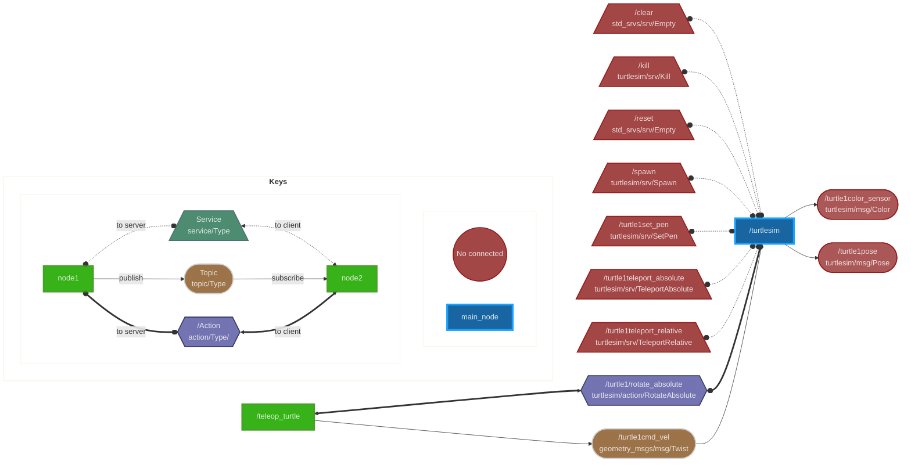

# ros2_graph
Generate mermaid description of ROS2 graphs to add on your markdown files.

## Motivation

In order to have better architecture documentation, graphs of nodes and topics are needed. Nonetheless, nobody wants to maintain these graphs and even do it from scratch.  Because of that, a tool that does it automatedly is required. The first alternative is [rqt-graph](http://wiki.ros.org/rqt_graph) but it does not include services/actions information and adds some non-required information when we filter by a node. Normally the workflow includes connecting to a terminal where the ros system is running, launching the `rqt-graph`, saving the resulting image, and uploading it to the cloud to include it in the documentation.

To make our life easier and to generate graphs that include all the information that we want this tool was created

## Installation
You need to have already installed ROS2 (tested on humble distro).

```
pip install ros2-graph
```

To be able to export the diagram as an image install npm and [mermaid-cli](https://github.com/mermaid-js/mermaid-cli) on your computer

```
curl -sL https://deb.nodesource.com/setup_16.x | sudo -E bash -
sudo apt install nodejs
npm install -g @mermaid-js/mermaid-cli
```

## How it works
 Suppose you want to generate a graph that shows how a node it's relates to other nodes by topics, services, and actions. All you need to do is run the script:

```
ros2_graph your_node
```
This will print in the console a graph description in the mermaid language, then you have to copy and paste it on the node's readme and enjoy. But if you want export it to a file use the `-o` flag.

Example

```
ros2_graph /turtlesim -o turtle_diagram.md
```

You can also  export the diagram as an image (png, svg or pdf) by setting the right file extension or using the flag --outputFormat:

```
ros2_graph /turtlesim -o turtle_diagram.png
ros2_graph /turtlesim -o turtle_diagram --outputFormat png
```


**Note:** you must copy everything between *\`\`\`mermaid* and *\`\`\`* including both marks.

GitHub can display mermaid graphs. You can also display it on VS code by adding an extension in the devcontainer.json: "bierner.markdown-mermaid"

But what about nodes highly correlated as the range sensors, it does not make sense to have a graph for each node, Well don't worry you can include all the nodes that you want:

```
ros2_graph node_1 node_2 … node_n
```

Example:

```
ros2_graph /turtlesim /teleop_turtle
```


See an example graph:


```
flowchart LR

/turtlesim:::main
/teleop_turtle:::node
/turtle1cmd_vel([/turtle1cmd_vel<br>geometry_msgs/msg/Twist]):::topic
/turtle1color_sensor([/turtle1color_sensor<br>turtlesim/msg/Color]):::bugged
/turtle1pose([/turtle1pose<br>turtlesim/msg/Pose]):::bugged
/clear[//clear<br>std_srvs/srv/Empty\]:::bugged
/kill[//kill<br>turtlesim/srv/Kill\]:::bugged
/reset[//reset<br>std_srvs/srv/Empty\]:::bugged
/spawn[//spawn<br>turtlesim/srv/Spawn\]:::bugged
/turtle1set_pen[//turtle1set_pen<br>turtlesim/srv/SetPen\]:::bugged
/turtle1teleport_absolute[//turtle1teleport_absolute<br>turtlesim/srv/TeleportAbsolute\]:::bugged
/turtle1teleport_relative[//turtle1teleport_relative<br>turtlesim/srv/TeleportRelative\]:::bugged
/turtle1/rotate_absolute{{/turtle1/rotate_absolute<br>turtlesim/action/RotateAbsolute}}:::action
/clear o-.-o /turtlesim
/kill o-.-o /turtlesim
/reset o-.-o /turtlesim
/spawn o-.-o /turtlesim
/turtle1set_pen o-.-o /turtlesim
/turtle1teleport_absolute o-.-o /turtlesim
/turtle1teleport_relative o-.-o /turtlesim
/teleop_turtle <==> /turtle1/rotate_absolute
/turtle1/rotate_absolute o==o /turtlesim
/turtle1cmd_vel --> /turtlesim
/turtlesim --> /turtle1color_sensor
/turtlesim --> /turtle1pose
/teleop_turtle --> /turtle1cmd_vel
subgraph keys[<b>Keys<b/>]
subgraph nodes[<b><b/>]
topicb((No connected)):::bugged
main_node:::main_node
end
subgraph connection[<b><b/>]
node1:::node
node2:::node
node1 o-. to server .-o service[/Service<br>service/Type\]:::service
service <-. to client .-> node2
node1 -- publish --> topic([Topic<br>topic/Type]):::topic
topic -- subscribe --> node2
node1 o== to server ==o action{{/Action<br>action/Type/}}:::action
action <== to client ==> node2
end
end
classDef node opacity:0.9,fill:#2A0,stroke:#391,stroke-width:4px,color:#fff
classDef action opacity:0.9,fill:#66A,stroke:#225,stroke-width:2px,color:#fff
classDef service opacity:0.9,fill:#3B8062,stroke:#3B6062,stroke-width:2px,color:#fff
classDef topic opacity:0.9,fill:#852,stroke:#CCC,stroke-width:2px,color:#fff
classDef main opacity:0.9,fill:#059,stroke:#09F,stroke-width:4px,color:#fff
classDef bugged opacity:0.9,fill:#933,stroke:#800,stroke-width:2px,color:#fff
style keys opacity:0.15,fill:#FFF
style nodes opacity:0.15,fill:#FFF
style connection opacity:0.15,fill:#FFF
```

## Custom syle

For custom mermaid styles use the `--styleConfig` flag to load a style .yaml file, it must look like this (Example with the default values, if a field is not defined the default will be used):

```yaml
shapes:
  main: ["[", "]"]
  node: ["[", "]"]
  topic: ["([", "])"]
  service: ["[/", "\\]"]
  action: ["{{", "}}"]
colors:
    main: "opacity:0.9,fill:#059,stroke:#09F,stroke-width:4px,color:#fff"
    node: "opacity:0.9,fill:#2A0,stroke:#391,stroke-width:4px,color:#fff"
    topic: "opacity:0.9,fill:#852,stroke:#CCC,stroke-width:2px,color:#fff"
    service: "opacity:0.9,fill:#3B8062,stroke:#3B6062,stroke-width:2px,color:#fff"
    action: "opacity:0.9,fill:#66A,stroke:#225,stroke-width:2px,color:#fff"
    no_conected: "opacity:0.9,fill:#933,stroke:#800,stroke-width:2px,color:#fff"
links_display:
  topics_publisher: "-->"
  topics_subscriber: "-->"
  services_server: "o-.-o"
  services_client: "<-.->"
  action_server: "o==o"
  action_client: "<==>"
links_style:
  topics_publisher:
  topics_subscriber:
  services_server:
  services_client:
  action_server: fill:none,stroke:green;
  action_client: fill:none,stroke:green;
display_keys: True
```