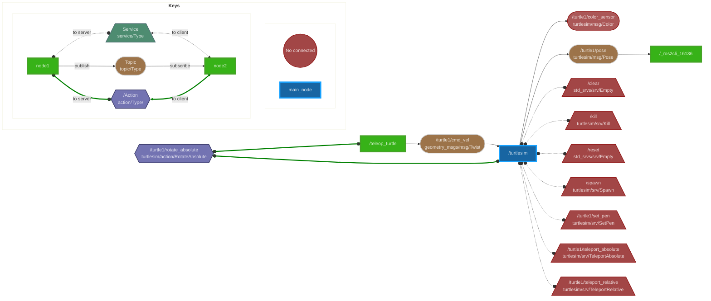

# ros2_graphs_mermaid
Generate mermaid description of ROS2 graphs to add on your markdown files.

## Instalation
```
pip install ros2-graphs-mermaid
```

## How it works
 Suppose you want to generate a graph that shows how a node it's relates to other nodes by topics, services, and actions. All you need to do is run the script:

```
python3 -m ros2_graphs_mermaid your_node
```
Example

```
python3 -m ros2_graphs_mermaid /turtlesim
```

This will print in the console a graph description in the mermaid language, then you have to copy and paste it on the node's readme and enjoy.

**Note:** you must copy everything between *\`\`\`mermaid* and *\`\`\`* including both marks.

GitHub can display mermaid graphs. You can also display it on VS code by adding an extension in the devcontainer.json: "bierner.markdown-mermaid"

But what about nodes highly correlated as the range sensors, it does not make sense to have a graph for each node, Well don't worry you can include all the nodes that you want:

```
python3 -m ros2_graphs_mermaid node_1 node_2 … node_n
```

Example:

```
python3 -m ros2_graphs_mermaid /turtlesim /teleop_turtle
```


See an example graph:

