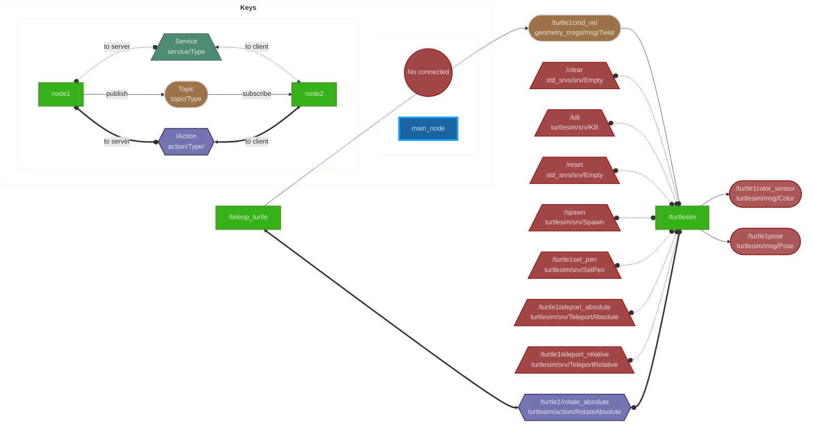

```mermaid
flowchart LR

/turtlesim:::main
/teleop_turtle:::node
/turtle1cmd_vel([/turtle1cmd_vel<br>geometry_msgs/msg/Twist]):::topic
/turtle1color_sensor([/turtle1color_sensor<br>turtlesim/msg/Color]):::bugged
/turtle1pose([/turtle1pose<br>turtlesim/msg/Pose]):::bugged
/clear[//clear<br>std_srvs/srv/Empty\]:::bugged
/kill[//kill<br>turtlesim/srv/Kill\]:::bugged
/reset[//reset<br>std_srvs/srv/Empty\]:::bugged
/spawn[//spawn<br>turtlesim/srv/Spawn\]:::bugged
/turtle1set_pen[//turtle1set_pen<br>turtlesim/srv/SetPen\]:::bugged
/turtle1teleport_absolute[//turtle1teleport_absolute<br>turtlesim/srv/TeleportAbsolute\]:::bugged
/turtle1teleport_relative[//turtle1teleport_relative<br>turtlesim/srv/TeleportRelative\]:::bugged
/turtle1/rotate_absolute{{/turtle1/rotate_absolute<br>turtlesim/action/RotateAbsolute}}:::action
/turtle1cmd_vel --> /turtlesim
/turtlesim --> /turtle1color_sensor
/turtlesim --> /turtle1pose
/teleop_turtle --> /turtle1cmd_vel
/clear o-.-o /turtlesim
/kill o-.-o /turtlesim
/reset o-.-o /turtlesim
/spawn o-.-o /turtlesim
/turtle1set_pen o-.-o /turtlesim
/turtle1teleport_absolute o-.-o /turtlesim
/turtle1teleport_relative o-.-o /turtlesim
/teleop_turtle <==> /turtle1/rotate_absolute
/turtle1/rotate_absolute o==o /turtlesim
subgraph keys[<b>Keys<b/>]
subgraph nodes[<b><b/>]
topicb((No connected)):::bugged
main_node:::main_node
end
subgraph connection[<b><b/>]
node1:::node
node2:::node
node1 o-. to server .-o service[/Service<br>service/Type\]:::service
service <-. to client .-> node2
node1 -- publish --> topic([Topic<br>topic/Type]):::topic
topic -- subscribe --> node2
node1 o== to server ==o action{{/Action<br>action/Type/}}:::action
action <== to client ==> node2
end
end
classDef node opacity:0.9,fill:#2A0,stroke:#391,stroke-width:4px,color:#fff
classDef action opacity:0.9,fill:#66A,stroke:#225,stroke-width:2px,color:#fff
classDef service opacity:0.9,fill:#3B8062,stroke:#3B6062,stroke-width:2px,color:#fff
classDef topic opacity:0.9,fill:#852,stroke:#CCC,stroke-width:2px,color:#fff
classDef main_node opacity:0.9,fill:#059,stroke:#09F,stroke-width:4px,color:#fff
classDef bugged opacity:0.9,fill:#933,stroke:#800,stroke-width:2px,color:#fff
style keys opacity:0.15,fill:#FFF
style nodes opacity:0.15,fill:#FFF
style connection opacity:0.15,fill:#FFF
```
